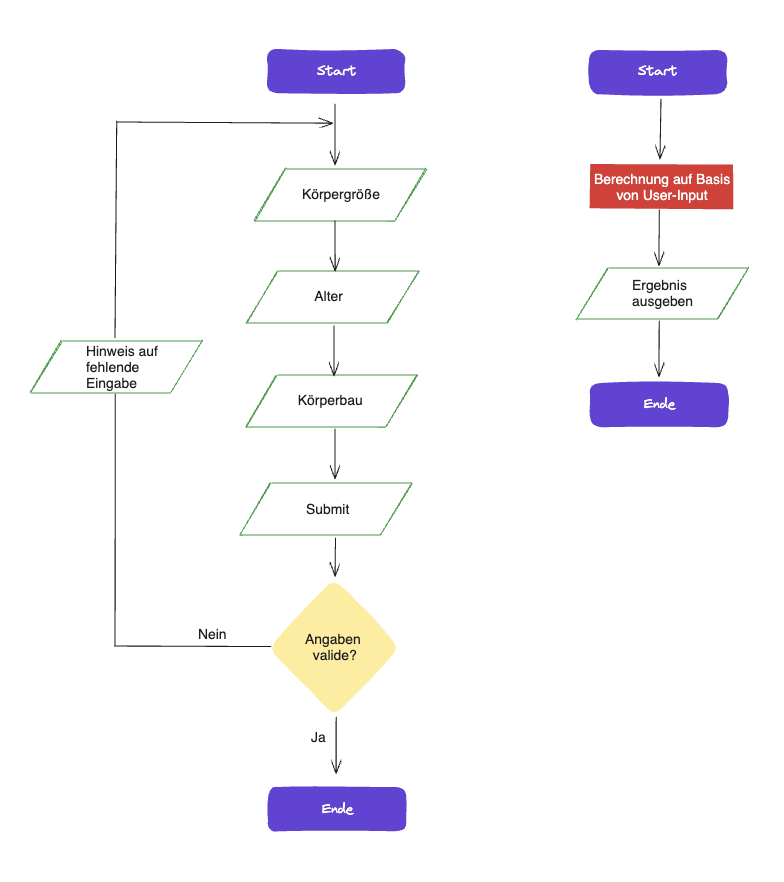

# Projekt_Idealgewicht-Rechner

Mithilfe dieser webbasierten Applikation können Anwender:innen intuitiv ihr ideales Körpergewicht basierend auf ihrer Körpergröße, ihrem Alter und ihrem Körperbau ermitteln.

# Tech Stack

- HTML5
- CSS3
- JavaScript

# Demo-Link

https://yacineyldrm.github.io/Projekt_Idealgewicht-Rechner/

# Screenshot

# Flow-Chart

